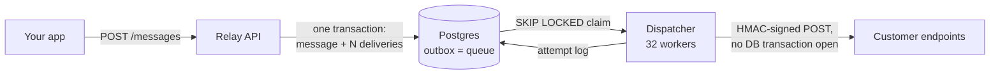
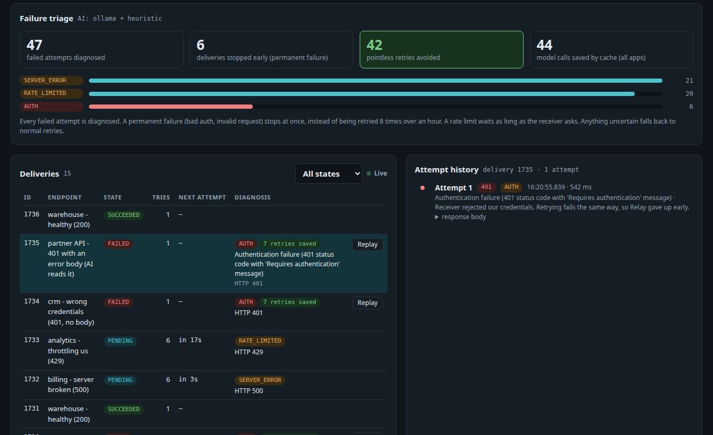

# Relay

[](https://github.com/jaidevdileep24/relay/actions/workflows/ci.yml)
  

**A webhook delivery service.** Relay accepts events from your app and guarantees they
reach your customers' HTTPS endpoints, with signed requests, jittered retries, a circuit
breaker, a dead-letter queue with replay, and a full attempt-by-attempt audit trail. It is
a small [Svix](https://svix.com), built on Java 21, Spring Boot 3.5 and Postgres 16.

| | |
|---|---|
| **Ingest** | **1,000 req/s at p99 25 ms**, 0 errors; saturates around 1,300 req/s (~2,600 delivery rows/s) |
| **Dispatch** | **390 deliveries/s** at default config against a 50 ms receiver, **29× the original design** |
| **Correctness** | 0 duplicate sends across every benchmark; 119 tests on a real Postgres (Testcontainers) |

All numbers are from one laptop, with the app, database and load generator sharing 12
cores. Methodology and raw results are in **[docs/benchmarks.md](docs/benchmarks.md)**.



Full diagrams (system, dispatch sequence, state machine and ER) are in
**[docs/architecture.md](docs/architecture.md)**.



*A live run of `demo/demo.sh` against the local `llama3.2` model:*
- *Each 401 stopped after 1 attempt instead of 8, so 42 pointless retries were never made.*
- *The model read GitHub's error body and wrote its own diagnosis.*
- *The 500s and 429s keep retrying, as they should.*

## What's interesting in here

- **Transactional outbox.** The message and every delivery row are written in one
  transaction, so an accepted event cannot be lost and there is no dual write to a broker.
  [ADR-0001](docs/adr/0001-transactional-outbox-in-postgres.md)
- **`FOR UPDATE SKIP LOCKED` + leases.** N workers pull disjoint work with no
  coordinator, and crash recovery is just lease expiry.
  [ADR-0002](docs/adr/0002-skip-locked-queue-with-leases.md)
- **No network I/O inside a transaction.** Claim, send and record are three steps, so
  connection hold time doesn't depend on how slow a receiver is.
  [ADR-0003](docs/adr/0003-no-http-inside-a-transaction.md)
- **A benchmark-driven dispatcher rewrite.** The original poll loop was capped at
  13.6/s no matter how fast receivers were. Claiming only for free threads removed both
  the cap and head-of-line blocking.
  [ADR-0011](docs/adr/0011-continuous-drain-dispatcher.md)
- **LLM failure triage.** Every failed attempt is diagnosed from its response body, not
  just its status code. A rejected signature or bad credentials stops after 1 attempt
  instead of 8, and a `429` waits as long as the receiver asks. The console counts the
  retries this saved. The classifier is cached, optional, never throws, and can never
  extend the retry budget.
  [ADR-0010](docs/adr/0010-ai-failure-triage.md)
- **The hard parts of a public API, handled:**
  - SSRF guard on every resolved IP, re-checked at send time, with redirects refused.
  - Tenancy-scoped routes that return 404, never 403.
  - Idempotency keys that return 422 on a body mismatch.
  - A sort-field allowlist.
  - 503 + `Retry-After` under overload.

All 12 decisions, with their trade-offs: **[docs/adr/](docs/adr/README.md)**.

## Tech stack

| | |
|---|---|
| **Language / framework** | Java 21 · Spring Boot 3.5 (Web, Data JPA, Validation, Actuator, Scheduling) |
| **Database** | PostgreSQL 16 · Flyway migrations · Hibernate in `validate` mode only |
| **AI** | Ollama (`llama3.2`) for local dev · Claude via `anthropic-java` with structured outputs |
| **Testing** | JUnit 5 · Testcontainers (real Postgres, never H2) · k6 load tests |
| **Tooling** | Maven · Docker Compose · GitHub Actions · springdoc-openapi |

## Run it

```bash
export JAVA_HOME=/usr/lib/jvm/java-21-openjdk-amd64
docker compose up -d          # Postgres 16 on host port 5433
mvn spring-boot:run           # http://localhost:8080
```

| | |
|---|---|
| `http://localhost:8080/` | **Relay Console**: create apps and endpoints, send events, browse deliveries and attempts, replay the DLQ |
| `http://localhost:8080/swagger-ui.html` | OpenAPI docs, including the shared error contract |
| `http://localhost:8080/actuator/health` | health |

### Demo

```bash
# Optional: let the local model read failure bodies (Ollama with llama3.2 pulled)
mvn spring-boot:run -Dspring-boot.run.arguments="--relay.ai.provider=ollama --relay.ai.timeout-ms=60000"

demo/demo.sh     # in another terminal; prints a console link
```

The script creates an application with five endpoints:
- one healthy
- one returning 500
- one returning 401 with no body
- one returning 401 with an error body for the AI to read
- one returning 429

It then sends three events and shows idempotency and the SSRF guard. Receivers are public
test URLs (`httpbin.org`, `api.github.com`), because Relay correctly refuses to call
`localhost`.

### Quick tour with curl

```bash
APP=$(curl -s -XPOST localhost:8080/api/v1/applications \
        -H 'Content-Type: application/json' -d '{"name":"acme"}' | jq -r .id)

# Endpoint URLs must be public HTTPS (SSRF guard). The secret is shown ONCE.
curl -s -XPOST localhost:8080/api/v1/applications/$APP/endpoints \
     -H 'Content-Type: application/json' \
     -d '{"url":"https://your-receiver.example/hook","eventTypes":["invoice.paid"]}' | jq

curl -s -XPOST localhost:8080/api/v1/applications/$APP/messages \
     -H 'Content-Type: application/json' -H 'Idempotency-Key: order-42' \
     -d '{"eventType":"invoice.paid","payload":{"amount":4200,"currency":"INR"}}' | jq

curl -s "localhost:8080/api/v1/applications/$APP/deliveries?state=FAILED" | jq   # the DLQ
```

Receivers verify the signature as described in
[docs/verifying-webhooks.md](docs/verifying-webhooks.md).

### Tests and benchmarks

```bash
mvn test                                        # full suite, real Postgres via Testcontainers
mvn test -Dtest='!OllamaFailureClassifierIT'    # skip the live-model test (~80 s)
```

Benchmark commands are in [docs/benchmarks.md](docs/benchmarks.md#reproduce).

## Configuration

Everything tunable lives under `relay.*` in `application.yml`, bound to `RelayProperties`:

- `dispatch`: worker threads, claim size, poll interval, HTTP timeout
- `retry`: attempts, base delay, cap
- `rate-limit`: per-endpoint rate and burst
- `breaker`: failure threshold
- `ai`: `none` | `ollama` | `claude`; off by default

## Project layout

```
src/main/java/com/dileep/relay
├── api/          REST controllers, DTOs (records), global error handling
├── service/      business logic: ingest (outbox), endpoints, deliveries, SSRF guard
├── dispatch/     worker loop, HTTP sender, HMAC signer
├── retry/        full-jitter backoff policy
├── ratelimit/    per-endpoint token bucket
├── ai/           failure classifiers: heuristic, caching, hybrid, Ollama, Claude
├── domain/       JPA entities and the delivery state machine
├── repository/   Spring Data repositories, including the SKIP LOCKED claim query
└── config/       typed `relay.*` properties
src/main/resources/db/migration   Flyway migrations V1–V6
docs/             architecture, ADRs, benchmarks, webhook verification guide
loadtest/         k6 scripts
demo/             seeded demo scenario
```

**Layer rule:** `api → service → repository`. Entities never leave the service layer; only
DTOs cross the API boundary.

## Roadmap

- [x] Ingest with transactional outbox and idempotency keys
- [x] Async dispatcher with leases, full-jitter retries, circuit breaker
- [x] HMAC signatures (Standard Webhooks), SSRF guard
- [x] Dead-letter queue, replay, per-endpoint rate limiting
- [x] LLM failure triage
- [x] Load tests, benchmarks, ADRs
- [ ] Kafka as an optional transport
- [ ] Extract insights and dispatch into separate services, when measurement justifies it
- [ ] Kubernetes deployment

## License

[MIT](LICENSE)

## Author

**Dileep Kumar Seerapu** · [GitHub](https://github.com/jaidevdileep24) ·
[LinkedIn](https://www.linkedin.com/in/dileep-kumar-seerapu-a34a89258)
