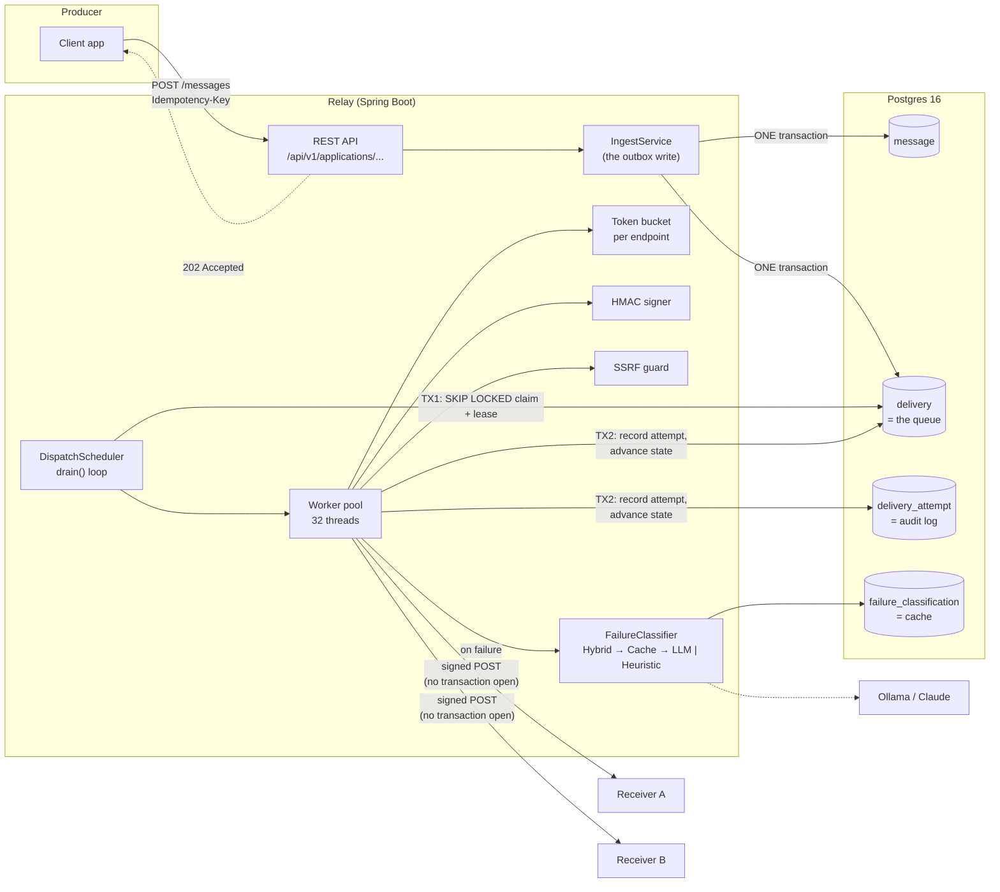
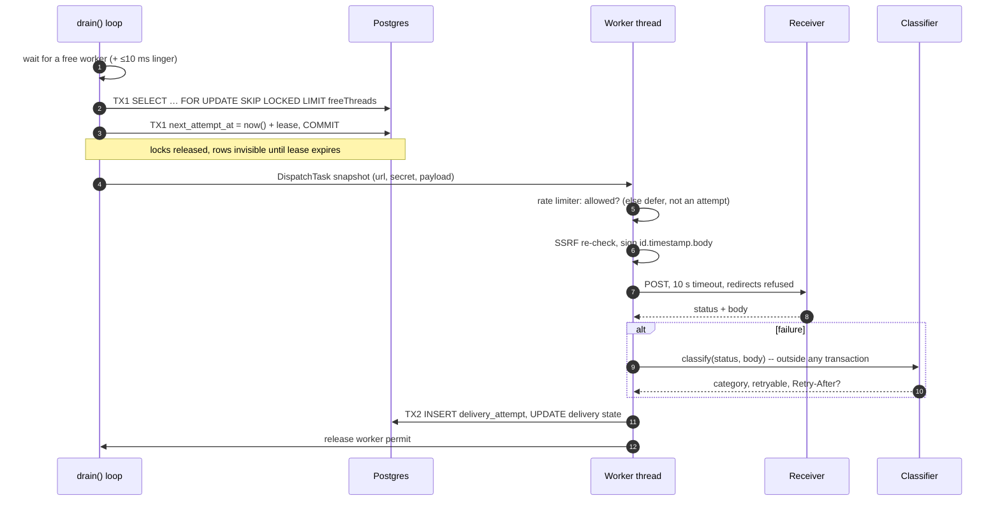
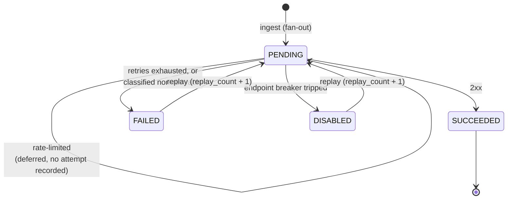
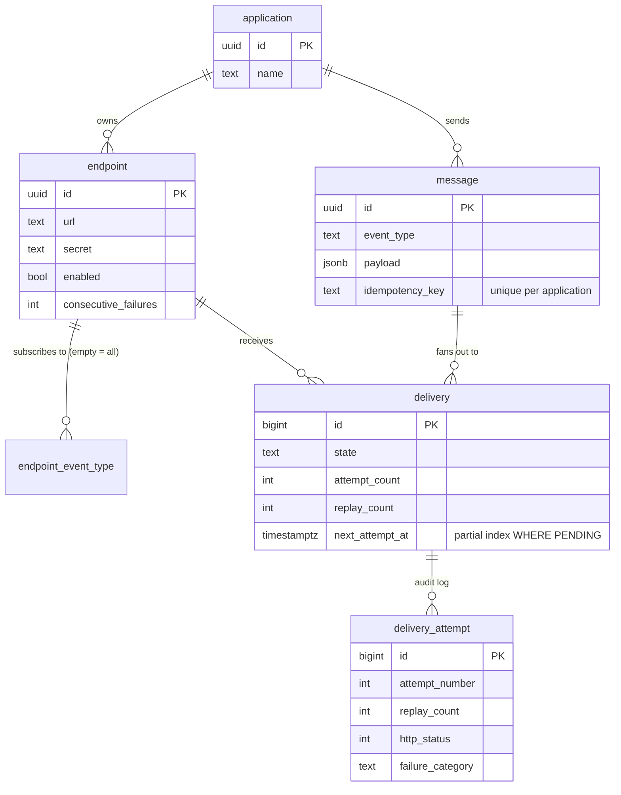

# Architecture

Relay accepts events and guarantees they reach other people's HTTPS endpoints, with
retries, signatures, a circuit breaker, a dead-letter queue and a full audit trail.

## System overview



## The two invariants everything else rests on

1. **Ingest writes the message and every delivery row in one transaction**
   ([ADR-0001](adr/0001-transactional-outbox-in-postgres.md)). Ingest never sends HTTP.
2. **No network call inside a transaction**
   ([ADR-0003](adr/0003-no-http-inside-a-transaction.md)). That covers webhook sends and
   LLM calls alike.

## Dispatch, one delivery



## Delivery state machine



`FAILED` + `DISABLED` together form the **dead-letter queue**. Only they are replayable:
a `PENDING` row may be leased by a worker at this moment
([ADR-0008](adr/0008-replay-reuses-delivery-row.md)).

## Data model



The id strategy is deliberately mixed:

- **UUIDs** for application, endpoint and message. They appear in public URLs, and
  sequential ids would leak volume.
- **`BIGSERIAL`** for delivery and delivery_attempt. These are internal and very
  high-volume, and monotonic ids keep the indexes tight. Delivery ids come from a pooled
  sequence, so fan-out INSERTs batch.

## Package layout

```
com.dileep.relay
├── api/          controllers, DTOs (records), GlobalExceptionHandler, Pages (sort allowlist)
├── domain/       Application · Endpoint · Message · Delivery · DeliveryAttempt · DbTime
├── repository/   Spring Data JPA; DeliveryRepository holds the SKIP LOCKED claim
├── service/      interfaces + impl/; SsrfGuard
├── dispatch/     DispatchScheduler · DispatchWorker · HttpSender · HmacSignatureSigner
├── retry/        FullJitterRetryPolicy (Strategy)
├── ratelimit/    TokenBucketRateLimiter
├── ai/           FailureClassifier + Hybrid / Caching / Ollama / Claude / Heuristic
└── config/       RelayProperties (relay.*), OpenApiConfig
```

Layer rule: `api → service → repository`. Controllers never touch repositories, and
entities never cross the API boundary (DTOs do).

## Where it would go next

| Pressure | Response | Status |
|---|---|---|
| More than one instance | `SKIP LOCKED` already supports it; move the rate limiter to Redis | [ADR-0009](adr/0009-per-process-rate-limiter.md) |
| Per-delivery recording cost | batch TX2 across completions | [ADR-0011](adr/0011-continuous-drain-dispatcher.md) |
| Downstream consumers of events | relay the outbox into Kafka (P6) | roadmap |
| Attempt table growth | partition `delivery_attempt` by month, drop old partitions | roadmap |
